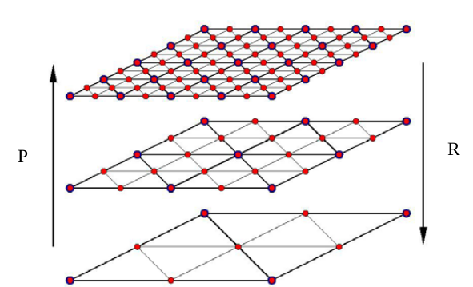
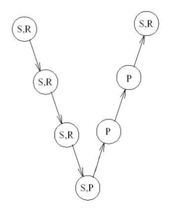
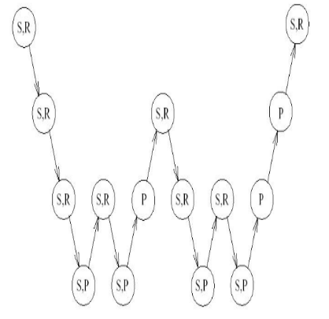

Introduction to Multi grid approach
=====================================
Since radiation with P1 model is inherently for steady state applications. Therfore it becomes imperative to solve radiation for the steady state. 

With the formulation of :math:`Ax=b`, the solution that is G can be obtained by inverting A.

But however due to large size of the matrix generated. Solving the the equation with conjugate gradient or any other krylov subspace seems to be compute expensive.

However krylov subspace methods can be used as the pre-conditioner in the multi-grid approach where matrix is solved on the low resolution and further the errors are corrected on to the fine resolutions.

Steps involved in multi grid approach
-------------------------------------
- Solve governing equations on the fine mesh until the partial convergence.
- Calculate the residual error on the fine mesh.
- The residual error on the fine mesh is transformed to coarse mesh to calculate the correction factor called (Correction vector) using again Gauss Seidel or Gauss Jordan method.
- The  correction vector calculated on the coarse mesh is again transferred to the fine mesh using simple interpolation techniques called (Prolongation method).
- Final solution is obtained from adding initial partial converged solution (obtained from step 1) with the correction vector.

This can be easily understood by the following diagram 

where P and R represents the prolongation and restriction of the errors that are solved on various grid levels. The restriction operator is transpose of interpolation operator :math:`R=P^T`

The three main steps involved in generation of prolongation/restrictor operator are as follows

- Generation of strength of connection matrix
- Splitting of fine matrix as coarse node and fine node
- Generation of interpolation matrix by assigning approprite weights to the node
- Performing Galerkin operator on the fine matrix as :math:`P^TAP` 

The algorithm differ by generation of splitting matrix as proposed many researchers, which of them include

- Ruge stuben classical AMG approach :cite:p:`stuben1999algebraic`
- Point-wise aggregate method
- Plain aggregates
- Smoothed aggregates using energy minimisation :cite:`sala2008new`

Different apporaches of multi grid method
------------------------------------------
Different combinations of prolongation, restrictor and smoothner procedures are followed as shown in the figure, where *P*, *R* and *S* represents prolongation and restriction operator and *S* represents solving for error i.e, 
:math:`Ae=r` where e is error and r is residual, using any of the iterative solver primarily Krylov subspace methods are preferred. 

|pic1|  |pic2|

 Combinations of prolongation, restriction and smoother are operated called V cycle and W cycle respectively (from left to right) :cite:p:`Stroia2015GPUAG`

