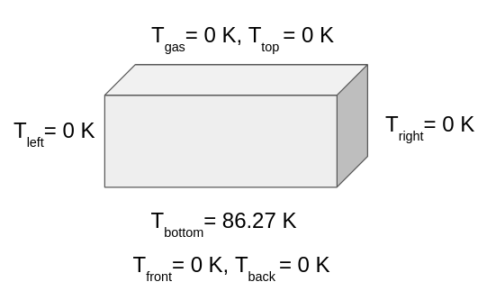
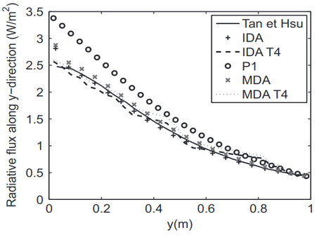
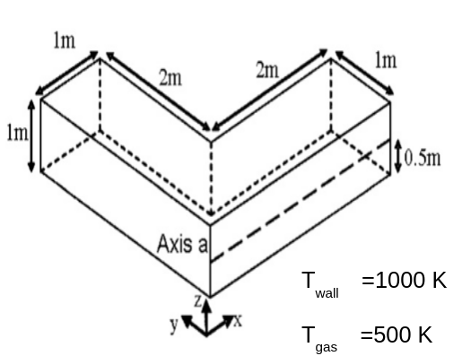
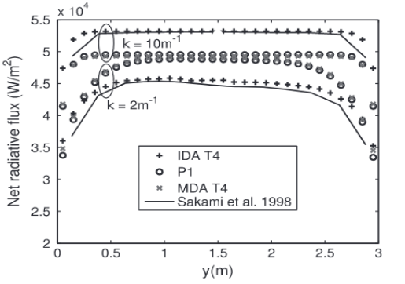
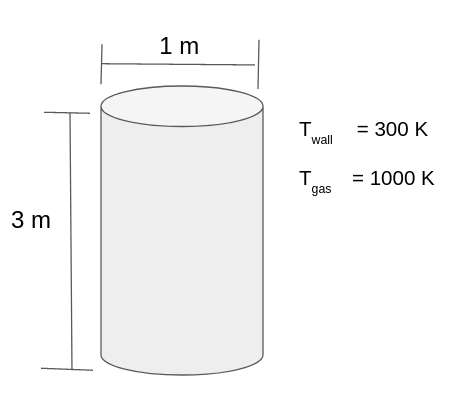

Radiation with AMGCL solver
===========================
AMGCL is the header-only C++ solver for algebraic multi-grid approach release under MIT license (BSD license). The library supports the both shared memory and distrubutd memory (MPI) algorithms based on the compact storage formats.
The advantage of this solver is that the matrices are processed in the compact form by considering only non-zeroes entries. Some of the compact storage formats are listed below 

- Compressed row storage
- Compressed column storage
- Co-ordinate storage format

The algorithm for these storage formats can be seen from here
http://netlib.org/linalg/html_templates/node91.html.

This solver houses many iterative solvers designed for sparse matrix. The details of which can be found here https://amgcl.readthedocs.io/en/latest/components/iter_solvers.html

Pure radiation test cases
-------------------------
The pure radiation test cases are proposed by :cite:p:`gerardin2012p1`.

**Test Case 1**

The radiative heat flux is evaluated at the bottom wall for the validation
Property of the gas is taken to be 

:math:`\kappa=1 m^{-1}`
:math:`\Omega=1 m^{-1}`

Numerical validation can be done agianst the analytical solution (Ten et Hsu) and with P1 solution for the validation of implementation as shown in the graph below

**Test Case 2**

   
- This case enables to test for corner effects if it exists
- This test case helps in analysing complex geometry
- Radiative heat flux and radiative source term is evaluated for validation
- Black wall is considered (ϵ=1)
- Medium is considered to be only absorbing (⍵=0)
- Radiative heat flux is evaluated on a-a axis of the wall

Validation is done against for the property of gas medium  𝜿=2  and  𝜿=10 
:math:`m^{-1}`

**Test Case 3**

- Homogeneous absorbing medium is considered (⍵=0)
- The radiative heat flux is evaluated at the wall for validation
- Wall is considered to be black (ϵ=1)
- The radiative heat flux and radiative source term is evaluated for validation

Validation is done against for the property of gas medium 𝜿=1 and 𝜿=10 
:math:`m^{-1}`

.. image:: Result3.png
   :width: 800px
   :height: 800px
   :scale: 50 %
   :alt: alternate text
   :align: center

Steps to set-up the problem
---------------------------
- Discretise the P1 governing equation for the geometry. This may be bit complicated for complex geometry.
- Apply boundary conditions and convert it into sparse matrix using AMGCL backend function.
- Setup the multi-grid solver using suitable smoother, preconditioner and transfer operators available.
- Run the case for the solution and extract suitable results from the solution.

This multi grid steps and algorithm availbale in AMGCL solver as as shoen table

.. list-table::
   :widths: 25 25 25
   :header-rows: 1

   * - Steps in Multi-grid
     - Present development
     - AMGCL
   * - Coarsening/Interpolation strategy
     - RugeStuben algorithm
     - RugeStuben, point-wise aggregation, plain aggregation, smooth aggregation
   * - Relaxtion strategy
     - damped jacobi (mpi)
     - Chebychev, damped jacobi,ilu, gauss siedel
   * - Smoothening Strategy
     - BiCGStab (CSR format), CG (CSR format)
     - BiCGStab,CG, gmres,idrs,skylineLU,Richardon

